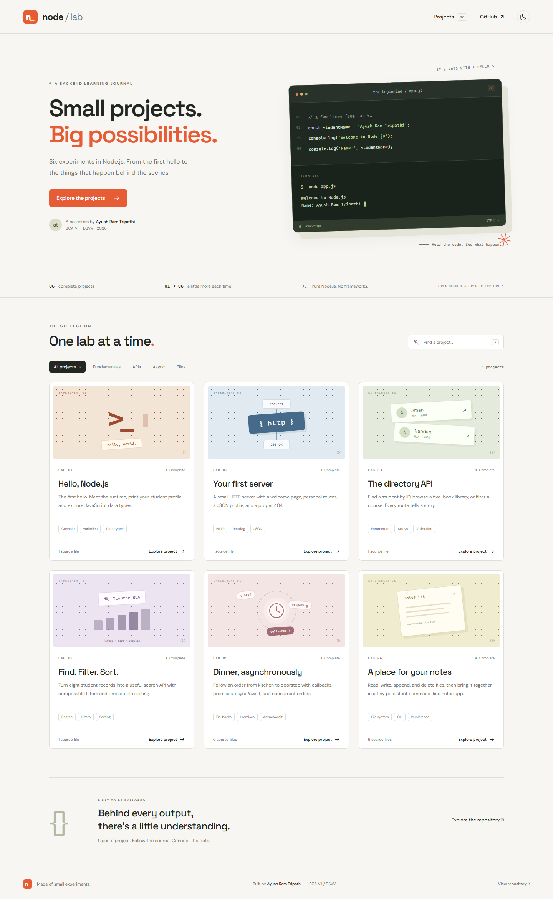

# Node.js Lab — Six Projects & an Interactive Portfolio

Six completed CS403NOD lab assignments, organized into independent projects. The website lists every project and opens its source files, actual recorded output, screenshots, and assignment guide.

**Student:** Ayush Ram Tripathi · **Scholar number:** 23145004 · **Course:** BCA · **Semester:** VII · **College:** DSVV

**Subject:** Node.js · **Labs:** 01–06 · **Date:** 02 October 2026



## Open the website

From this repository folder:

```sh
npm start
```

Open **http://localhost:4173**. You can also open `index.html` directly; project sources are bundled into `assets/projects-data.js` so the code browser works without a server or internet access. Fonts are included locally.

The portfolio has project search, category filters, a line-numbered code viewer, file switching, code copying and downloads, recorded output sections, zoomable screenshots, keyboard navigation, and a persistent light/dark theme. Each project has a direct link such as `/#project/advanced-search`.

The website displays captured execution from the Node programs. API projects run separately with Node.js; static hosting does not execute their servers.

## Projects

| Lab | Project folder | Topics | Main command |
| --- | --- | --- | --- |
| 01 | [Getting started](projects/lab-01-getting-started) | Console, student variables, five data types, browser/Node differences | `node app.js` |
| 02 | [HTTP server](projects/lab-02-http-server) | Five routes, JSON profile, 404, configurable PORT, architecture | `node server.js` |
| 03 | [Student directory](projects/lab-03-student-directory) | Student IDs, five-book directory, course filter, invalid IDs | `node students-server.js` |
| 04 | [Advanced search](projects/lab-04-advanced-search) | AND filters, partial search, name/marks sorting, validation, bonus route | `node advanced-server.js` |
| 05 | [Food delivery](projects/lab-05-food-delivery) | Callbacks, Promises, chaining, async/await, Promise.all | `node async-await-version.js` |
| 06 | [File system](projects/lab-06-file-system) | Async/sync reads, write/append/delete, copy, persistent CLI notes | `node add-note.js "Buy groceries"` |

Run each command from its project folder. Each folder includes `package.json`, a README covering the tasks, reflection or architecture notes where required, raw output evidence, code screenshots, and output screenshots. No project uses runtime dependencies. See the individual READMEs for all routes, commands, expected errors, and optional environment variables.

The original assignment PDFs remain in [`tasks/`](tasks). The original installation screenshot is preserved in Lab 01. Student details were taken from the original output screenshot. The root `node app.js` command still launches the complete Lab 01 program.

## Verification and reproducible evidence

Node.js 22 or newer is required. Use the latest [Node.js LTS](https://nodejs.org/en/about/previous-releases) for coursework. The original installation evidence records Node 22.16.0 and npm 10.9.2; the new evidence was captured with Node 24 LTS, installed locally using `npx --yes --package=node@24 node`. The exact verification runtime is recorded in `assets/captured-output.json` and Lab 01's `runtime-version.txt` and screenshot. All 85 lab checks passed with both the system runtime and Node 24.

```sh
npm ci
npm test
npx playwright install chromium
npm run test:website
```

`npm test` verifies the assignment behavior: API responses and errors, filter combinations, all sort directions, both Promise outcomes, lifecycle failure handling, real concurrent timing, file overwrites/appends/deletions, identical copies, and persisted notes. File-system checks run in temporary directories, preserving personal notes.

To refresh source data, execution evidence, and screenshots after changing a project:

```sh
npm run capture
npm run build
npm run screenshots
npm run test:website
```

Capture runs the actual programs and sends HTTP requests to real local servers. Lab 05 runs the random Promise program at least five times and continues until both outcomes are recorded. Screenshots render these captured results in a readable terminal layout; the callback screenshot contains code and output side by side. There are 22 project images including the original runtime screenshot, plus desktop, project, and mobile website previews in `docs/`.

`npm run build` updates the website's source bundle from files on disk; it does not replace your code or README files. Only screenshot generation and browser checks require Playwright.

## Static hosting

The website is ready for GitHub Pages or any static host: publish the repository root with `index.html`, `assets/`, `projects/`, and `tasks/`. For GitHub Pages, [choose a publishing source](https://docs.github.com/en/pages/getting-started-with-github-pages/configuring-a-publishing-source-for-your-github-pages-site): **Settings → Pages → Deploy from a branch → main → / (root)** after these files are committed and pushed. `.nojekyll` preserves the static files. Publishing the portfolio does not host the Node API processes; run those independently as described above.

## Problems Faced

- The initial Lab 01 program only contained the data type task and differed from its screenshot. Required student details, messages, and variables are now implemented in the new Lab 01 folder.
- Random Promise outcomes do not guarantee a failure in exactly five runs. Capture continues until both paths appear.
- The second file deletion intentionally returns ENOENT; it is documented and handled with a clear message and failure exit code.
- Windows normalizes clipboard newlines to CRLF. Browser verification compares normalized text while retaining the exact source for copying and downloading.

## References & font licenses

The implementation and notes use the official [Node.js file system documentation](https://nodejs.org/api/fs.html), [Node.js event loop guide](https://nodejs.org/en/learn/asynchronous-work/event-loop-timers-and-nexttick), and [Playwright screenshot documentation](https://playwright.dev/docs/screenshots). The portfolio uses locally hosted DM Sans and Space Grotesk, licensed under the SIL Open Font License; license files are in `assets/fonts/`.
